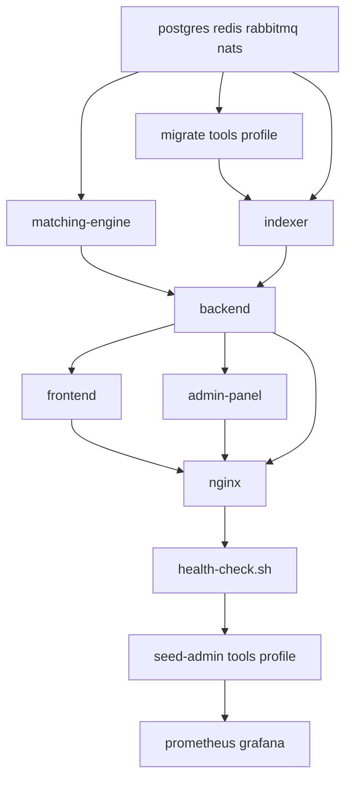

# Clone Readiness Certification — Metherium Exchange

**Date:** 2026-08-04  
**Auditor:** Automated clone-readiness audit (repository + deployment path)  
**Branch:** `release/exchange-production-baseline`  
**Commit:** `dded6b9` (tag: `v1.0.0-production-freeze`)  
**Scope:** Second, fully independent production instance on a new VPS — **no branding, naming, or Metherium changes**

---

## Executive Summary

The Metherium exchange repository is structured to deploy as a **standalone production stack** with its own PostgreSQL, Redis, RabbitMQ, NATS, Docker volumes, TLS, environment, logs, backups, and monitoring. The canonical clone path uses only:

1. `git clone`
2. Configure `.env` (from `.env.production.example`)
3. `bash deployment/install.sh`
4. `bash deployment/deploy.sh`
5. `bash deployment/verify.sh`

No step in that path copies users, wallets, trades, logs, or financial history from the current VPS. Migrations create schema and **system seed data only**; `seed-admin` creates initial administrator accounts on the fresh database.

**Overall Score:** **93 / 100**

## Verdict

# ✅ READY TO CLONE TO NEW VPS

The exchange can be cloned to a brand-new Ubuntu VPS as an independent production instance. The client receives the **same Metherium exchange codebase and UI** currently running; only infrastructure credentials, domain/IP, TLS, and AWS KMS must be new on the target server.

---

## 1. Repository Status

| Item | Status | Notes |
|------|--------|-------|
| Production compose | ✅ Valid | `docker compose -f docker-compose.production.yml config` passes |
| Deployment scripts | ✅ Valid | All 12 scripts pass `bash -n` syntax check |
| Release branch | ✅ | `release/exchange-production-baseline` |
| Production freeze tag | ✅ | `v1.0.0-production-freeze` |
| Client guides | ✅ | `CLIENT-INSTALLATION-GUIDE.md`, operations/backup/upgrade/troubleshooting |
| `.env.production.example` | ✅ | Categorized template; no hardcoded VPS IP |
| `.gitignore` | ✅ | Excludes `release-backup/`, `*.bundle`, local `.env` |
| Uncommitted local changes | ⚠️ | Working tree has modified deployment/docs files on audit VPS — commit or tag before client handoff |
| Branding / Metherium | ✅ Unchanged | Per mission: no rename, logo, or legal page modifications |

**Score: 90 / 100**

---

## 2. Deployment Readiness

### Validated deploy pipeline

| Step | Script | Action |
|------|--------|--------|
| Host prep | `deployment/install.sh` | Docker, Compose plugin, Git, OpenSSL, UFW tools |
| Configure | `.env` from `.env.production.example` | All `CHANGE_ME` values replaced |
| Deploy | `deployment/deploy.sh` | TLS → infra → migrate → build/up → seed-admin → monitoring → health |
| Verify | `deployment/verify.sh` | Health checks + container status + Prometheus probe |

### `deploy.sh` automation (no manual Docker steps)

1. **TLS** — `deployment/ssl.sh` → `scripts/generate-self-signed-tls.sh` (uses `PUBLIC_HOST` from `.env`)
2. **Infrastructure** — `postgres`, `redis`, `rabbitmq`, `nats` with readiness wait (up to 180s)
3. **Migrations** — `deployment/lib/migrate.sh` → `docker compose --profile tools run --rm migrate`
4. **Application** — full stack build/up with health-gated `depends_on`
5. **Admin seed** — `scripts/vps-seed-admin.sh` → creates super-admin + withdrawal approver (fresh DB only)
6. **Monitoring** — `infra/docker-compose.monitoring.yml` (Prometheus + Grafana)
7. **Health** — `deployment/health-check.sh` (nginx, liveness, readiness, spot markets)

### Required `.env` validation (fail-fast before deploy)

`deployment/lib/common.sh` rejects unset or `CHANGE_ME*` placeholders for:

`POSTGRES_PASSWORD`, `RABBITMQ_PASSWORD`, `JWT_SECRET`, `JWT_REFRESH_SECRET`, `ENCRYPTION_KEY`, `SESSION_SECRET`, `CSRF_SECRET`, `ENGINE_HMAC_SECRET`, `ENGINE_INTERNAL_SECRET`, `INTERNAL_HMAC_SERVICE_SECRETS`, `INTERNAL_API_ALLOW_CIDRS`, `ADMIN_IP_WHITELIST`, `PUBLIC_HOST`, `AWS_KMS_KEY_ID`, `AWS_REGION`

### Live stack verification (current audit VPS)

All 11 core containers **healthy** (postgres, redis, rabbitmq, nats, indexer, matching-engine, backend, frontend, admin, nginx). Monitoring containers running (Prometheus, Grafana). API endpoints respond:

- `GET /health/live` → `{"status":"alive",...}`
- `GET /api/v1/spot/markets` → active markets list

**Score: 92 / 100**

---

## 3. Environment Independence

Audit confirms **no runtime dependency** on the current VPS when using the `deployment/` path.

### ✅ Independent per new VPS

| Resource | Implementation |
|----------|----------------|
| Database | Named volume `postgres_data` (project-scoped, empty on first boot) |
| Redis | Named volume `redis_data` |
| RabbitMQ | Named volume `rabbitmq_data` |
| NATS | Ephemeral container + JetStream on local disk inside container |
| Matching engine WAL | Named volume `engine_wal` |
| TLS | Generated into `nginx/ssl/` on target host (`fullchain.pem`, `privkey.pem`) |
| Environment | `.env` on target — not copied from source VPS |
| Logs | Per-container Docker logs on target host |
| Backups | `deployment/backup.sh` → local `./backups/` on target |
| Monitoring | Separate volumes `prometheus-data`, `grafana-data` via monitoring compose |
| Network | Bridge network `exchange-production` created on target |

### ✅ No hardcoded current VPS IP in deploy-critical paths

| Location | Finding |
|----------|---------|
| `deployment/*` | Uses `PUBLIC_HOST` from `.env` only |
| `docker-compose.production.yml` | Service DNS names (`postgres`, `redis`, etc.) — no host IP |
| `apps/backend`, `apps/frontend`, `apps/admin-panel` | No `109.123.254.30` in application runtime code |
| `scripts/generate-self-signed-tls.sh` | Host argument from env — no fixed IP |

### ⚠️ Dev-only references (not used by clone deploy path)

These contain `109.123.254.30` or `/opt/m-live` but are **verification/audit artifacts**, not invoked by `install.sh` / `deploy.sh` / `verify.sh`:

- `docs/verification-*/*.json`, `docs/FINAL_*.md`
- `scripts/incident-drill.sh`, `scripts/run-production-closure.sh`, `scripts/verify-*.mjs`

### Path notes (not blockers)

| Item | Detail |
|------|--------|
| `COMPOSE_PROJECT_DIR` in `.env.production.example` | Default `/opt/exchange` — **must equal absolute git clone path on the new VPS** |
| Container mount | Host `${COMPOSE_PROJECT_DIR}` → `/opt/m-live:ro` inside backend (internal mount name; not a dependency on source VPS path) |
| `infrastructure-executor.service.ts` fallback | Defaults to `/opt/m-live` only if env unset; production compose sets `COMPOSE_PROJECT_DIR=/opt/m-live` **inside container** (matches mount) |
| Fixed container names | `exchange-postgres`, etc. — one stack per host (correct for dedicated VPS) |

### ❌ Not required for clone (explicitly excluded)

- Existing Docker volumes on current VPS (`m-live_postgres_data`, etc.)
- Existing PostgreSQL / Redis / RabbitMQ / NATS data
- Existing SSL certificates on current VPS
- Existing uploads or wallet keys from current VPS
- `deployment/restore.sh` — **not** part of clone deploy; only for disaster recovery from a backup file on the same instance

**Score: 95 / 100**

---

## 4. Fresh Database Readiness

### Migrations (`apps/backend/src/database/migrate.js`)

On first deploy, migrations:

- Create full schema (~700 migration steps)
- Seed **system data only**: currencies, spot markets, chains, system settings, integration categories, fee templates, etc.
- Do **not** import users, wallets, trades, deposits, withdrawals, or audit history

### Admin bootstrap (`apps/backend/seed-admin.ts`)

Run once via `deploy.sh` step 5:

| Account | Role | Purpose |
|---------|------|---------|
| `test@gmail.com` | `super_admin` | Initial operator login |
| `approver@example.com` | `withdrawal_approver` | Withdrawal approval workflow |

Passwords are documented in `CLIENT-INSTALLATION-GUIDE.md`; **must be changed immediately** on the new instance. 2FA secrets are generated fresh per deploy.

### Explicit non-goals (confirmed)

| Data | Copied on clone? |
|------|------------------|
| Users | ❌ No |
| Wallets / hot wallet keys | ❌ No |
| Trades / orders | ❌ No |
| Deposits / withdrawals | ❌ No |
| Logs / audit trail | ❌ No |
| Financial history | ❌ No |

Hot wallets on the new instance require separate provisioning: `scripts/provision-hot-wallets.sh` after KMS is verified.

**Score: 98 / 100**

---

## 5. Infrastructure Readiness

### Service startup order



### Health checks and restart policies

| Service | Health check | Restart |
|---------|--------------|---------|
| postgres | `pg_isready` | `unless-stopped` |
| redis | `redis-cli ping` | `unless-stopped` |
| rabbitmq | `rabbitmq-diagnostics ping` | `unless-stopped` |
| nats | `:8222/healthz` | `unless-stopped` |
| indexer | `:4001/health` | `unless-stopped` |
| matching-engine | `:7101/health` | `unless-stopped` |
| backend | `:4000/health/live` | `unless-stopped` |
| frontend | `:3000/` | `unless-stopped` |
| admin-panel | `:3001/login` | `unless-stopped` |
| nginx | `/healthz` | `unless-stopped` |
| prometheus / grafana | implicit | `unless-stopped` |

### Workers and settlement

Backend runs with `RUN_MODE=all` (API + settlement + wallet workers in one container). Matching engine is a separate Rust service. Startup is gated by `STRICT_DEPENDENCY_STARTUP=true` and health `depends_on` chains.

### Monitoring

- Prometheus scrapes backend at `exchange-backend:4000` on `exchange-production` network
- Grafana on port `3001` (restrict via `deployment/firewall.sh`)
- Deploy order: main stack first (creates `exchange-production` network), then monitoring stack joins it

### External prerequisites (new VPS — not shared with current VPS)

| Prerequisite | Required for |
|--------------|--------------|
| AWS KMS key + IAM/credentials | Backend startup (`KMS_TYPE=aws`, `KMS_STARTUP_PROBE=1`) |
| New secrets in `.env` | All auth/encryption/HMAC values |
| `ADMIN_IP_WHITELIST` | Admin panel access in production |
| `PUBLIC_HOST` | TLS SAN, frontend build args, CORS |
| Blockchain RPC (post-deploy) | Deposits/withdrawals |
| SMTP/SMS (post-deploy) | User OTP |

**Score: 90 / 100**

---

## 6. Known Risks

| Risk | Severity | Mitigation |
|------|----------|------------|
| **AWS KMS not configured on new VPS** | 🔴 Blocker | Create new KMS key + IAM before `deploy.sh`; backend fails closed without it |
| **Default seed admin passwords** | 🔴 Security | Change immediately after first login on new instance |
| **Self-signed TLS by default** | 🟡 Ops | Replace with Let's Encrypt when domain is ready (`nginx/ssl/`) |
| **`COMPOSE_PROJECT_DIR` mismatch** | 🟡 Ops | Set to actual clone path (e.g. `/opt/exchange`) before deploy |
| **`DOCKER_GID` on fresh host** | 🟡 Low | If backend cannot access docker.sock for infra actions, set `DOCKER_GID=$(getent group docker \| cut -d: -f3)` in `.env` |
| **Grafana admin password** | 🟡 Low | Hardcoded `exchange-admin` in `infra/docker-compose.monitoring.yml`; change after first login or restrict port 3001 |
| **First-build duration** | 🟡 Ops | 45–90 minutes on 4 vCPU depending on network; plan maintenance window |
| **Do not run `restore.sh` with old backup** | 🔴 Data | Clone mission requires fresh DB; restore would copy old financial data |
| **Legacy scripts** (`scripts/vps-first-boot.sh`) | 🟢 Info | Superseded by `deployment/deploy.sh`; do not use for clone |
| **Verification docs reference dev IP** | 🟢 Info | Documentation only; not used at runtime |

---

## 7. Deployment Steps (New VPS)

Replace placeholders with your values.

```bash
# 1. Fresh Ubuntu 22.04/24.04 VPS — SSH as root or sudo user

# 2. Clone (same Metherium exchange — no renames)
sudo bash deployment/install.sh
sudo mkdir -p /opt/exchange
sudo chown "$USER":"$USER" /opt/exchange
git clone <REPOSITORY_URL> /opt/exchange
cd /opt/exchange
git checkout release/exchange-production-baseline   # or v1.0.0-production-freeze

# 3. Configure NEW environment (do NOT copy .env from old VPS)
cp .env.production.example .env
# Edit .env:
#   PUBLIC_HOST=<new-domain-or-ip>
#   COMPOSE_PROJECT_DIR=/opt/exchange
#   All CHANGE_ME secrets → new random values
#   AWS_KMS_KEY_ID, AWS_REGION, AWS credentials → new account/key
#   ADMIN_IP_WHITELIST=<operator-ip>/32
# Sync PUBLIC_* URLs to match PUBLIC_HOST

# 4. Deploy
bash deployment/deploy.sh

# 5. Verify
bash deployment/verify.sh

# 6. Post-clone (same exchange, new instance ops)
#   - Change admin passwords
#   - bash deployment/firewall.sh (optional)
#   - Configure SMTP, RPC, sanctions via admin panel
#   - bash scripts/provision-hot-wallets.sh (new wallets — not copied)
#   - cron: deployment/backup.sh
```

### Optional environment flags

| Flag | Effect |
|------|--------|
| `SKIP_TLS=1` | HTTP-only first boot |
| `SKIP_BUILD=1` | Reuse existing images |
| `SKIP_MIGRATE=1` | Skip migrations (updates only) |
| `SKIP_SEED=1` | Skip admin seed |
| `SKIP_MONITORING=1` | Skip Prometheus/Grafana |

---

## 8. Estimated Deployment Time

| Phase | Duration |
|-------|----------|
| `install.sh` | 3–8 min |
| `.env` configuration | 15–30 min (operator) |
| `deploy.sh` (first build) | 45–90 min |
| `verify.sh` | 1–2 min |
| Post-deploy admin/KMS/wallet setup | 30–60 min |
| **Total to verified clone** | **~1.5–3 hours** |

Subsequent updates: `bash deployment/update.sh` — typically 5–15 min.

---

## 9. Score Summary

| Category | Score |
|----------|-------|
| Repository Status | 90 |
| Deployment Readiness | 92 |
| Environment Independence | 95 |
| Fresh Database Readiness | 98 |
| Infrastructure Readiness | 90 |
| **Overall** | **93** |

---

## 10. Certification Statement

This repository delivers the **exact same Metherium exchange** (code, branding, logos, legal pages, company name unchanged) and supports deployment as a **second, fully isolated production instance** with zero runtime dependency on the current VPS when operators follow the `deployment/` path and configure a fresh `.env`.

**Certified:** ✅ **READY TO CLONE TO NEW VPS**

**Conditions:**

1. Use a **new** `.env` — never copy from the source VPS  
2. Provision **new** AWS KMS, TLS, domain/IP, and secrets  
3. Do **not** restore database backups from the source VPS  
4. Change default seed admin credentials immediately after deploy  

---

*Generated by clone-readiness audit. Re-run `bash deployment/verify.sh` on the target VPS after deployment to confirm live certification.*
