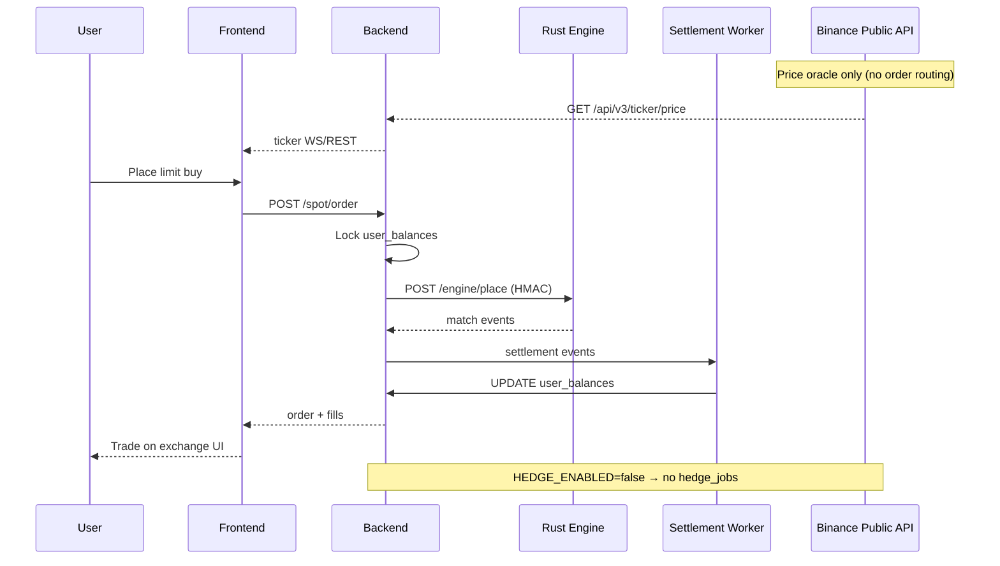

# Phase 6 — Binance Liquidity Audit

**Generated:** 2026-06-22  
**Classification:** **D — Partially Implemented** (hybrid infrastructure exists; **default runtime = A pure internal**)

---

## Configuration Defaults (verified)

File: `apps/backend/src/config/index.ts`

| Flag | Default | .env |
|------|---------|------|
| `HYBRID_ENABLED` | `false` | Not set |
| `HEDGE_ENABLED` | `false` | Not set |
| `PRICE_ORACLE_ENABLED` | — | `true` (.env ~241) |
| `EXTERNAL_PRICE_FEED_ENABLED` | — | `true` |
| `LIQUIDITY_BOT_ENABLED` | `false` | `false` (.env 268) |

**When hybrid off:** User orders never leave internal Rust engine.

---

## All Binance Touchpoints (grep-verified)

| File | Role |
|------|------|
| `lib/binance-signed-http.ts` | Signed REST to Binance API |
| `services/hedge-engine.service.ts` | Post-fill hedge execution |
| `services/price-oracle.service.ts` | Public ticker prices |
| `services/external-price-feed.service.ts` | External reference prices |
| `services/binance-spot-symbol-filters.service.ts` | LOT_SIZE, tick, minNotional |
| `services/candle-aggregation.service.ts` | Historical candle seed |
| `routes/admin-hybrid.fastify.ts` | Admin hybrid config |
| `scripts/qa-binance-testnet-validate.ts` | Testnet validation script |

**Frontend:** No direct Binance API — prices via backend only (e.g. `useReferencePrice.ts`).

---

## Actual Execution Model

### User orders — ALWAYS internal

```
User Order
  ↓ POST /api/v1/spot/order
Backend (spot.fastify.ts)
  ↓ placeOrderRust()
Matching Engine (Rust :7101) POST /engine/place
  ↓ match events
Settlement Worker
  ↓ user_balances update
User sees fill on-platform
```

**Binance is NOT in this path.**

### Optional post-fill hedge (when enabled)

```
Internal fill complete
  ↓ enqueueHedgeJobAfterInternalFill() [spot.fastify.ts ~1848]
hedge_jobs table
  ↓ hedge-engine.service.ts worker
binanceSignedPost('/api/v3/order') — LIMIT IOC
  ↓ external_orders audit
Desk hedges inventory; user balances unchanged
```

`hedge-engine.service.ts` line 2: *"Does not modify user balances."*

### Price feeds only (current default behavior)

```
Binance public API
  ↓ price-oracle.service / external-price-feed.service
market_prices / ticker cache
  ↓ GET /spot/markets/:symbol/ticker + WS
User UI charts & tickers
```

---

## Sequence Diagram (actual default deployment)



---

## Hybrid mode (when admin enables)

| Component | File |
|-----------|------|
| Decision | `hybrid-decision.service.ts` |
| Config store | `external-liquidity-config.service.ts` |
| Admin UI | `apps/admin-panel/.../liquidity/page.tsx` |
| Credentials crypto | `lib/hybrid-credentials-crypto.js` |

Plan `INTERNAL_PLUS_HEDGE` triggers hedge job enqueue — still **not** direct user routing.

---

## Reconciliation

| Mechanism | Evidence |
|-----------|----------|
| `hedge_jobs` + `external_orders` tables | migrate.ts 3752+ |
| Hedge exposure gauge | `hedge-risk.service.ts` |
| Tier-1 reconciliation | `tier1-reconciliation.service.ts` |

---

## Verdict

| Question | Answer |
|----------|--------|
| User orders routed to Binance? | **No** — engine only |
| Binance used for liquidity? | **Only if** `HEDGE_ENABLED=true` + provider configured — post-fill desk hedge |
| Binance exposed to users? | **No** — oracle prices only |
| Admin dynamic control? | **Yes** — `admin-hybrid.fastify.ts`, liquidity admin page |
| Production-ready hybrid? | **Partial** — infrastructure complete; defaults off; hedge enqueue gap on async settlement path |

**Model letter:** **B when fully enabled**, **A at current defaults**.
