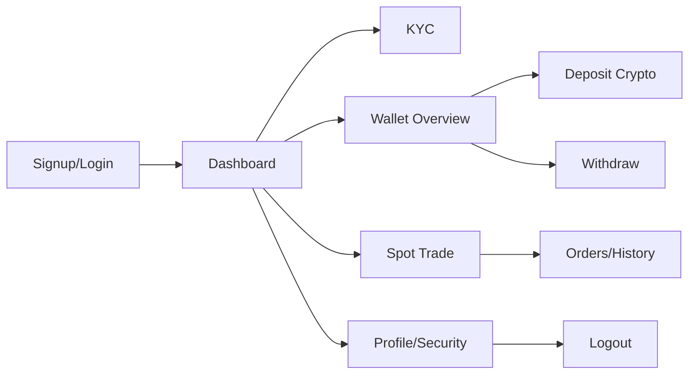

# Phase 2 — User Journey Audit

**Generated:** 2026-06-22  
**Method:** Code trace + Playwright login/deposit/spot flows

---

## Journey Map

---

## Step-by-Step Findings

### Signup (`/(auth)/signup`)

| Aspect | Finding |
|--------|---------|
| File | `apps/frontend/src/app/(auth)/signup/page.tsx` |
| Flow | Email/phone → OTP verification |
| Confusion | Same OTP-heavy pattern as login; no clear “password-only” path on signup |

### Login (`/(auth)/login`)

| Aspect | Finding |
|--------|---------|
| File | `apps/frontend/src/app/(auth)/login/page.tsx` |
| Modes | Password (default) + OTP + passkey |
| Runtime | Form renders (417 chars); password submit in Playwright sometimes **stays on `/login`** before manual navigation — session cookie/localStorage timing unclear to user |
| Confusion | Dual modes (password vs OTP) in tabs; passkey only after email typed |
| Missing feedback | No prominent “logged in” toast before redirect |

### KYC (`/dashboard/identity`)

| Aspect | Finding |
|--------|---------|
| Files | `dashboard/identity/page.tsx`, `upload/page.tsx`, `success/page.tsx` |
| Gate | Deposit page blocks address until KYC approved — modal → identity |
| Confusion | KYC status not surfaced on wallet overview hero |

### Dashboard (`/dashboard`)

| Aspect | Finding |
|--------|---------|
| File | `dashboard/page.tsx` (~1500 lines) |
| Loading | `RailCardPreviewSkeleton` for cards |
| Confusion | Many parallel entry points to same flows (wallet vs assets vs dashboard) |

### Wallet (`/wallet`)

| Aspect | Finding |
|--------|---------|
| Canonical overview | `dashboard/assets/overview/page.tsx` |
| Confusion | INR card says self-serve deposit not live; “Fiat deposit” link goes to help, not flow |

### Deposit (`/wallet/deposit/crypto`)

| Aspect | Finding |
|--------|---------|
| Runtime | ✅ QR (`hasQR: true`), copy affordance, 859 chars body |
| Steps | Coin → chain → address (3 steps — appropriate) |
| Confusion | Header still mentions fiat deposit → help anchor |
| Missing | No estimated arrival time until history tab |

### Withdraw (`/wallet/withdraw` → crypto)

| Aspect | Finding |
|--------|---------|
| Hub | `/wallet/withdraw` — good crypto vs INR split |
| Confusion | `/dashboard/withdraw` skips hub → crypto only |
| Crypto flow | Review step + 2FA — good |
| Bug UX | `?coin=` ignored on withdraw (honored on deposit only) |
| Dead control | Help FAB on withdraw has no action (`withdraw/crypto/page.tsx`) |

### Spot Trading (`/trade/spot`)

| Aspect | Finding |
|--------|---------|
| Runtime | Logged in: Limit/Market, 7 chart canvases, 2 `[data-spot-place-order]` buttons |
| Confusion | Stream connecting banners until WS live |
| Extra clicks | Advanced order types hidden in `▾` select |

### Trade History

| Paths | `/dashboard/orders/spot`, `/wallet/history`, spot bottom panel |
| Confusion | Three places for overlapping data |

### Profile / Settings

| Paths | `/dashboard/account`, `/dashboard/security/*`, `/dashboard/preferences` |
| OK | Standard security hub pattern |

### Logout

| Pattern | Auth store clear + redirect — via security sessions page |

---

## Cross-Cutting UX Issues

| # | Issue | Severity |
|---|-------|----------|
| 1 | Legacy `/dashboard/*` vs canonical `/wallet/*` URLs | P2 |
| 2 | Login redirect not always immediate (Playwright evidence) | P1 |
| 3 | No fiat deposit but UI references it | P1 |
| 4 | Withdraw routing inconsistency (hub vs direct) | P2 |
| 5 | P2P v1 + v2 parallel nav | P2 |
| 6 | KYC gate surprise on deposit | P2 |

---

## Unnecessary Clicks

1. Dashboard → Wallet → Deposit (could be one header action — partially exists)
2. Spot: open `▾` for stop orders
3. History: pick tab within tab (“All Transactions” vs “History”)

---

## Screenshots

- `audit/screenshots/spot-logged-in.png`
- `audit/screenshots/deposit-mobile.png`
- `audit/screenshots/quick-wallet-deposit-crypto.png`
