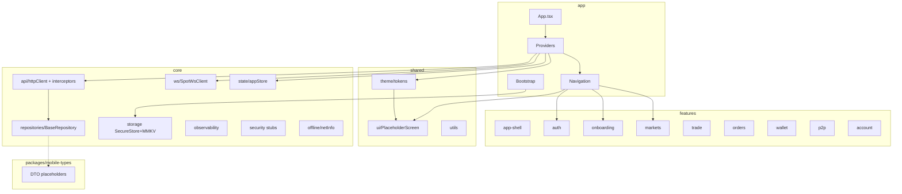

# MOB-002 — Sprint 0 Foundation Implementation Report

**Sprint:** MOB-002 Sprint 0  
**Date:** 2026-07-10  
**Backend SHA (frozen):** `00988649da52031923e2d62bf4f9c2fdc384f479`  
**Scope:** Foundation only — no business features  
**Status:** COMPLETE

---

## 1. Pre-Implementation Safety Report

| Check | Result | Evidence |
|-------|--------|----------|
| Backend SHA frozen | PASS | `git rev-parse HEAD` = `00988649da52031923e2d62bf4f9c2fdc384f479` |
| Existing web untouched | PASS | `apps/frontend` — no git changes |
| Existing APIs unchanged | PASS | `apps/backend` — no git changes |
| Existing Docker untouched | PASS | `docker/`, `docker-compose.yml` — no git changes |
| Existing production untouched | PASS | No modifications to backend, web, admin, matching engine, indexer |
| Architecture docs immutable | PASS | Implementation references frozen MOB-001A/B/C; no redesign |

**Allowed modification scope:** `apps/mobile/`, `packages/mobile-types/`, `.github/workflows/mobile.yml` (mobile-only CI skeleton).

---

## 2. Implementation Summary

Sprint 0 delivered the production-grade mobile foundation per frozen architecture documents under `docs/mobile-product-architecture/`.

| # | Deliverable | Status |
|---|-------------|--------|
| 1 | `apps/mobile` scaffold | DONE |
| 2 | Folder structure per MOB-001C-FOLDER-STRUCTURE.md | DONE |
| 3 | Expo Dev Client + RN + TS + React Navigation 7 | DONE |
| 4 | Theme engine (MOB-001B tokens) | DONE |
| 5 | Navigation skeleton (auth, tabs, nested, deep links, guards) | DONE |
| 6 | Global providers (Query, Zustand, Theme, Safe Area, Gesture, i18n, ErrorBoundary, Network, App State) | DONE |
| 7 | Repository foundation (BaseRepository, HTTP client, interceptors, serializer, error mapper, retry, cancellation, auth hooks) | DONE |
| 8 | WebSocket foundation (SpotWsClient, lifecycle, heartbeat, subscription manager, reconnect policy) | DONE |
| 9 | Secure storage (SecureStore + MMKV abstraction) | DONE |
| 10 | Environment layer (dev/qa/uat/production) | DONE |
| 11 | Logging / analytics / crash / performance abstractions | DONE |
| 12 | Testing foundation (Jest, RNTL, Maestro smoke) | DONE |
| 13 | Lint / Prettier / TypeScript / import rules / path aliases | DONE |
| 14 | CI skeleton (GitHub Actions + EAS profiles) | DONE |
| 15 | Architecture validation | DONE |

**Explicitly NOT implemented (per sprint rules):** business logic, trading, wallet, P2P, authentication endpoints, API integrations beyond foundation wiring, feature screens.

---

## 3. Architecture Validation Report

### 3.1 Automated Validation

```
npm run validate:architecture  → PASSED
npm run typecheck              → PASSED (0 errors)
npm run test -- --ci           → PASSED (3 suites, 3 tests)
npm run lint                   → PASSED (0 errors, 1 warning)
```

### 3.2 Folder Structure Compliance

Required directories from `MOB-001C-FOLDER-STRUCTURE.md` verified present:

- `app/providers`, `app/navigation`, `app/bootstrap`
- `features/*` (9 modules with `index.ts` barrels)
- `core/api` (+ interceptors), `core/ws`, `core/storage`, `core/security`, `core/offline`, `core/observability`
- `shared/theme`, `shared/ui`
- `assets/`, `tests/`, `e2e/`, `docs/`

### 3.3 Dependency Direction

| Layer | May import | Verified |
|-------|------------|----------|
| `app` | features, shared, core | PASS |
| `features/*` | shared, core | PASS — no cross-feature imports |
| `shared` | core (types/config only) | PASS |
| `core` | packages/mobile-types | PASS — no `@features` imports in core/shared |

### 3.4 Import Rules

- ESLint `import/no-cycle`: enabled
- `no-restricted-imports`: blocks deep `@features/*/*` imports
- Architecture scanner: 0 boundary violations

### 3.5 Module Ownership

| Module | Owner (frozen) | Sprint 0 state |
|--------|----------------|----------------|
| app-shell | Platform | Barrel + placeholder nav |
| auth | Identity | Barrel + AuthNavigator placeholders |
| onboarding | Growth | Barrel + OnboardingNavigator |
| markets/trade/orders/wallet/p2p/account | Per 1C | Barrels only |

### 3.6 Circular Dependencies

None detected (lint rule + manual scan).

---

## 4. Dependency Graph



**Direction rule:** `app → features/shared → core → mobile-types` (acyclic).

---

## 5. Files Created

### 5.1 `apps/mobile/` (107 files, excluding node_modules)

| Category | Count | Key paths |
|----------|-------|-----------|
| Config | 12 | `package.json`, `app.config.ts`, `eas.json`, `tsconfig.json`, `.eslintrc.js` |
| App shell | 18 | `app/App.tsx`, providers (8), navigation (7), bootstrap (3) |
| Core | 35 | `core/api/*`, `core/ws/*`, `core/storage/*`, `core/security/*`, `core/offline/*`, `core/observability/*` |
| Shared | 11 | `shared/theme/*`, `shared/ui/layout/PlaceholderScreen.tsx` |
| Features | 9 | `features/*/index.ts` barrels |
| Tests | 6 | `tests/unit/*`, `tests/component/*`, `tests/setup.ts` |
| E2E | 4 | `e2e/auth/smoke.yaml` + flow placeholders |
| Assets | 4 | `.gitkeep` in images/icons/fonts/lottie |
| Scripts/Docs | 3 | `scripts/validate-architecture.mjs`, `docs/ONBOARDING-DEV.md`, `README.md` |

### 5.2 `packages/mobile-types/` (7 files)

- `package.json`, `tsconfig.json`
- `src/index.ts`, `src/auth.ts`, `src/spot.ts`, `src/wallet.ts`, `src/p2p.ts`

### 5.3 CI

- `.github/workflows/mobile.yml` — path-filtered mobile validation job

### 5.4 Documentation (this sprint)

- `MOB-002-SPRINT0-REPORT.md`
- `MOB-002-FOUNDATION-CERTIFICATE.md`

---

## 6. Files Modified

| Path | Modified? | Notes |
|------|-----------|-------|
| `apps/backend/**` | NO | — |
| `apps/frontend/**` | NO | — |
| `apps/admin-panel/**` | NO | — |
| `docker/**` | NO | — |
| `docker-compose.yml` | NO | — |
| Root `package.json` | NO | — |
| Root `package-lock.json` | NO | Restored after transient npm install side-effect |
| `apps/mobile/**` | YES (new) | Entire scaffold |
| `packages/mobile-types/**` | YES (new) | DTO placeholders |
| `.github/workflows/mobile.yml` | YES (new) | Mobile-only CI |

---

## 7. Safety Report (Post-Implementation)

| Area | Modified | Verified |
|------|----------|----------|
| Backend | NO | `git status apps/backend` clean |
| Web (frontend) | NO | `git status apps/frontend` clean |
| Admin | NO | `git status apps/admin-panel` clean |
| Database | NO | No schema/migration changes |
| APIs | NO | No backend route changes |
| Docker | NO | No compose/Dockerfile changes |
| Infrastructure | NO | No prod infra changes |
| Production exchange | NO | HEAD unchanged at frozen SHA |

---

## 8. Self-Audit (Three Passes)

### Pass 1 — Architecture

- Folder tree matches MOB-001C-FOLDER-STRUCTURE.md
- Layer import rules enforced
- No business endpoints implemented
- Navigation skeleton only (S-000 splash → auth placeholders → 5-tab placeholders)
- Theme tokens sourced from MOB-001B design system
- **Result: PASS**

### Pass 2 — Maintainability

- Feature barrels expose public API only
- Core concerns isolated (api, ws, storage, observability)
- TypeScript strict mode enabled
- Path aliases: `@app/*`, `@core/*`, `@shared/*`, `@features/*`, `@exchange/mobile-types`
- Test foundation with unit + component + Maestro smoke
- **Result: PASS**

### Pass 3 — Production Safety

- Zero changes to frozen exchange codebase
- Mobile CI path-filtered (`apps/mobile/**`, `packages/mobile-types/**`)
- No hardcoded production secrets
- Environment URLs via `app.config.ts` + EAS secrets pattern
- Root lockfile restored — no monorepo dependency drift
- **Result: PASS**

---

## 9. Known Limitations (Sprint 0 Expected)

| Item | Status | Sprint 1 action |
|------|--------|-----------------|
| Feature screens (194) | Not implemented | Per MOB-001B screen specs |
| Repository endpoint methods | Not implemented | Per MOB-001C API catalog |
| WS subscriptions / ticket auth | Foundation only | Per MOB-001C WS architecture |
| Observability providers | Stubs (no Sentry/Amplitude keys) | Wire in Sprint 1+ |
| `apps/mobile/package-lock.json` | Not committed | Generate on Mac/CI with `npm install --legacy-peer-deps` |
| ESLint warning in `types.ts` | 1 warning (empty interface extension) | Cosmetic; RN Navigation convention |

---

## 10. Verification Commands

```bash
cd apps/mobile
npm install --legacy-peer-deps   # first-time setup
npm run typecheck
npm run test -- --ci
npm run validate:architecture
npm run lint
```

---

## 11. References (Frozen)

| Document | Purpose |
|----------|---------|
| MOB-001A | Product architecture |
| MOB-001B | UX/UI + design tokens |
| MOB-001C-ENGINEERING | Master engineering architecture |
| MOB-001C-FOLDER-STRUCTURE | Folder tree (implemented) |
| MOB-001C-API-ARCHITECTURE | HTTP/repository patterns |
| MOB-001C-WEBSOCKET-ARCHITECTURE | WS client patterns |
| MOB-001C-STATE-MANAGEMENT | TanStack Query + Zustand |
| MOB-001C-CICD | CI/EAS profiles |
| MOB-001C-ADR | Technology decisions |

---

**Sprint 0 Foundation: COMPLETE**  
See `MOB-002-FOUNDATION-CERTIFICATE.md` for final gate certification.
